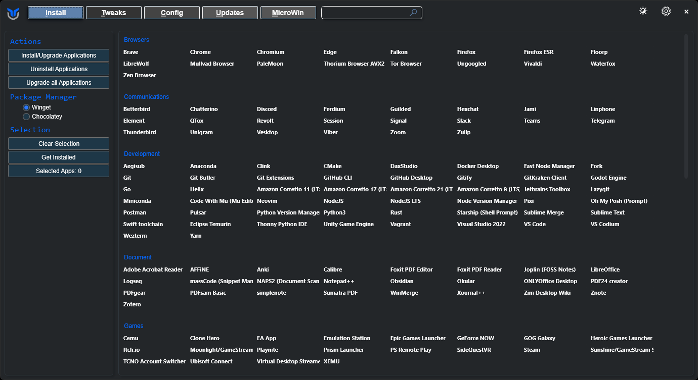
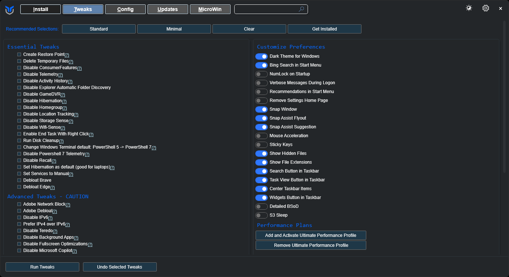
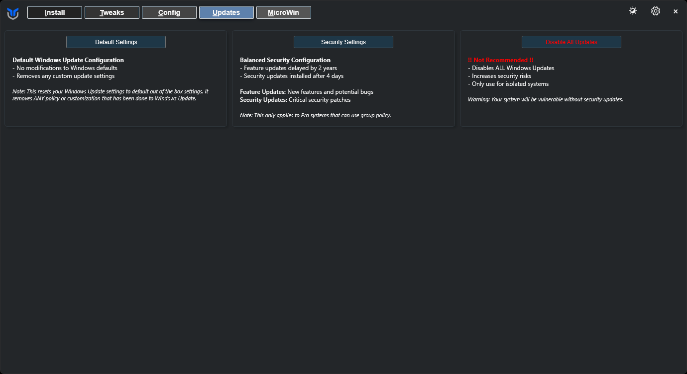

# Chris Titus Tool

Esta é uma ferramenta que evoluiu ao longo de vários anos e que faz muito mais do que apenas melhorar o desempenho uma instalação do Windows.

## Ferramenta

Roda o seguinte comando no PowerShell como administrador.

```
iwr -useb https://christitus.com/win | iex
```

Existem 3 partes principais que vamos utilizar: `Install`, `Tweaks` e `Updates`.

## Install

O `Install` é praticamente uma versão melhor do [Ninite](https://ninite.com/) que muitas pessoas usam. É utilizado a utilidade winget da Microsoft para instalar ou atualizar várias aplicações automaticamente sem ser necessária qualquer ação do utilizador.



## Tweaks

:::danger

Uso indevido desta secção pode quebrar a tua instalação, por isso segue as instruções com atenção.

:::

Esta secção é a mais importante desta ferramenta e da documentação inteira, pois é o que vai melhorar o desempenho do Windows na sua totalidade.

Para fazer um debloat simples e rápido, faz o seguinte:

- Em `Recommended Selections`, carrega em `Standard`
- Em `Performance Plans`, carrega em `Add and Activate Ultimate Performance Profile`

Depois, carrega em `Run Tweaks` para fazer o debloat do Windows. Espera até que o PowerShell que usaste para rodar a ferramenta diga `Tweaks are Finished` e reinicia o PC.



## Updates

Nesta secção, podemos controlar as atualizações do Windows. Se e **só** se tiveres a versão Pro do Windows instalada, carrega em `Security Settings` para que apenas as atualizações importantes para a tua segurança sejam instaladas, assim não será necessário fazer debloat do Windows novamente após cada atualização.

