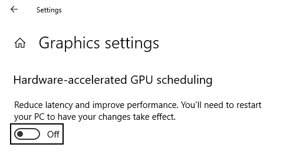
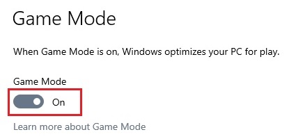

# Definições do Windows

Embora poucas, algumas definições do Windows podem benificiar ou prejudicar o desempenho da máquina.

## Hardware-accelerated GPU scheduling

O Hardware-accelerated GPU scheduling transfere muitas das tarefas do processador para a placa gráfica. Isto irá ajudar mais o quão pior for o processador e melhor a placa gráfica.

Se não tiveres esta opção na tua máquina, é possível que não é suportada pela tua placa gráfica ou pelos drivers da mesma.

## Game Mode

O Game Mode reserva recursos do processador e da placa gráfica para jogos.

