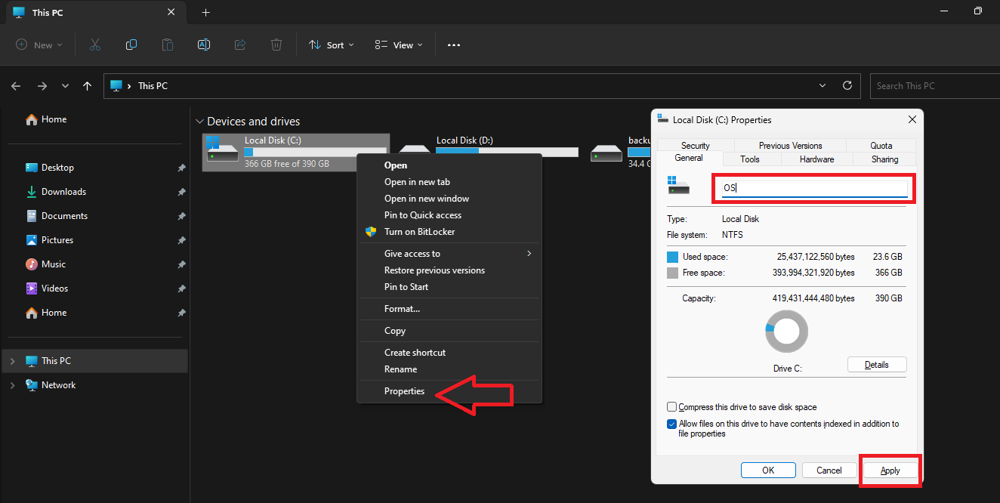
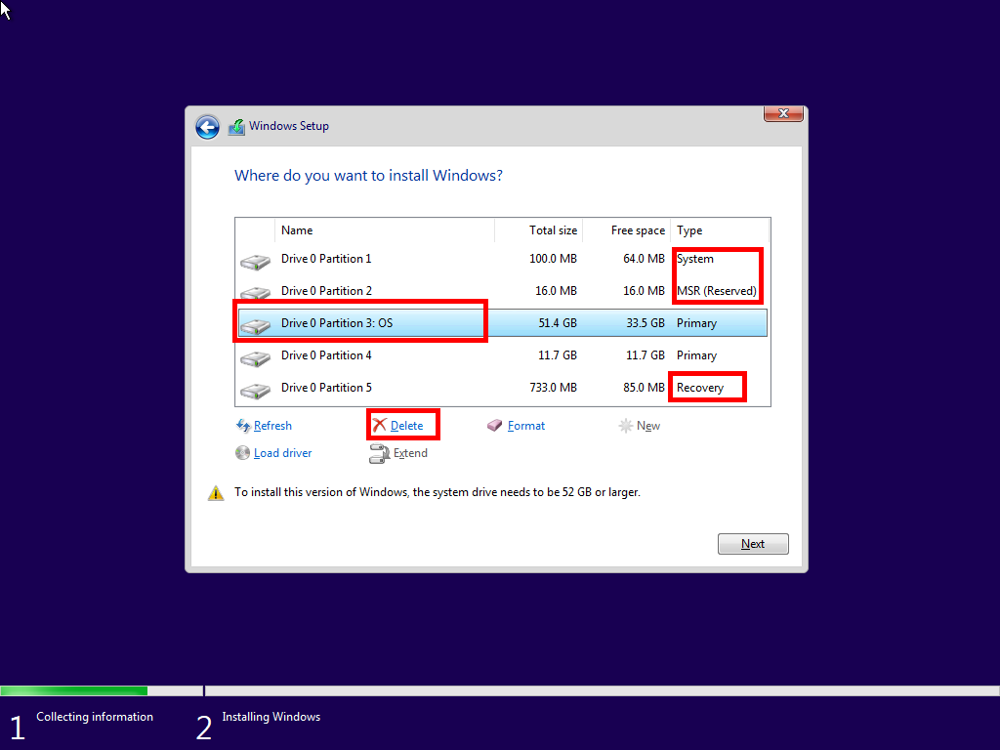
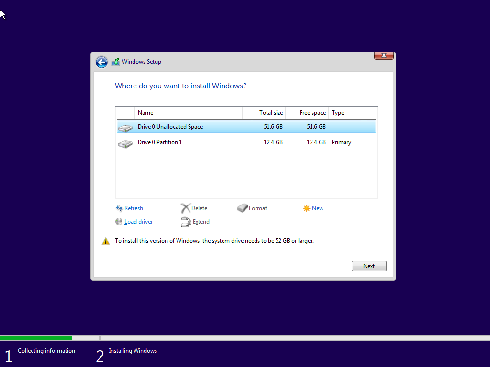
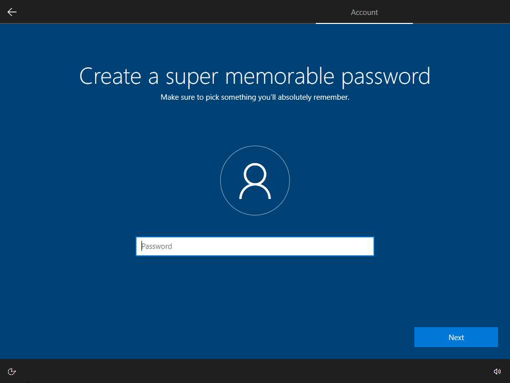

# Instalar o Windows

## Preparação

Antes de começar, verifica que fazes o seguinte:

- Nomeia a tua partição atual do Windows como `Windows` ou `OS` para que possas identificar facilmente mais tarde

- Desliga a ligação à rede durante o processo de instalação

## Arranque a partir da unidade USB inicializável

### Método 1: Ambiente de Recuperação do Windows

- Carrega `Win` + `R` no teu teclado para abrir o `Run`
- Escreve `shutdown /r /t 1 /o` e carrega em `OK`
- Espera até que o teu PC reinicie e veres o ecrã `Choose an option`
- Carrega em `Use a device`
- Seleciona `EFI USB Device` ou o nome da tua unidade USB

Se a tua unidade USB estiver a faltar neste menu, continua com o método 2.

### Método 2: BIOS

Primeiro **consulta o manual** da tua placa-mãe ou portátil, e descobre **qual tecla** abre o **menu de arranque**. Teclas comuns são **Esc, F2, F8, F9, F10, F11, F12, Del**.

Desliga o teu PC por completo e depois liga-o novamente. Assim que o teu monitor mostrar alguma coisa, começa a **carregar rapidamente na tecla do menu de arranque** até o menu abrir.

Deverá aparecer uma lista com todas as opções de arranque. Escolhe a opção com o **nome da tua unidade USB**. Se selecionaste `GPT` enquanto configuravas a unidade USB, seleciona a opção que arranca no modo UEFI.

Alternativamente, podes entrar nas definições da BIOS e mudar a ordem de arranque. O teu PC vai tentar todas as opções na ordem que tu definires. Portanto, se definires a unidade USB como a **primeira opção de arranque**, vai ser preferência sobre as outras opções, permitindo que arranques dela facilmente.

## Instalação

### Configuração

Assim que o instalador do Windows iniciar, vais te encontrar num ecrâ para selecionar o idioma, formato de hora e método de entrada. Ao acabar de selecionar todas as opções, o teu PC vai reiniciar para começar a instalação.

Assim que o teu PC iniciar novamente, vais te encontrar num ecrã a pedir por uma chave de produto. Se possuires uma chave oficial de Windows, podes inseri-la agora. Se não tiveres uma chave, carrega em `I don't have a product key`.

Na escolha de sistema operativo para instalar, certifica-te que selecionas a versão `Pro` em ambos Windows 10 e 11. Esta versão contém todas as funcionalidades do Windows e mais que são exclusivas e não estão presentes em outras versões de Windows (Home, Education, etc).

A este ponto, vai te ser apresentado os termos de licença da Microsoft, que vais ter que aceitar para poder proceder com a instalação do Windows.

No tipo de instalação, certifica-te que escolhes `Custom: Install Windows only (advanced)` para avançar com uma instalação limpa do Windows sem qualquer ficheiro antigo.

### Partições

Se seguiste os passos de preparação, a tua partição de SO deverá ser facilmente identificável.

Seleciona a tua partição de SO e carrega em `Delete`. Faz o mesmo para todas as partições do tipo `System`, `MSR` e `Recovery`.

Deverá haver agora uma partição chamada `Unallocated Space`. Seleciona esta partição e carrega em `Next` para começar a instalação.

Quando a instalação acabar, o teu PC vai reiniciar automaticamente. Assim que o PC reiniciar, remove a unidade USB do PC para que ele não inicie pela unidade USB novamente.

### Conclusão

Depois de reiniciar, o instalador vai te pedir para escolher a região e o layout de teclado. Se tiveres um teclado que tem layout ANSI invês de ISO, escolhe o layout inglês e adiciona um segundo layout português (ou vice-versa).

Se o instalador ainda te pedir para conectar a uma rede, carrega em `I don't have internet`, e depois em `Continue with limited setup`.

Se seguiste os passos de preparação, o instalador vai te pedir apenas por um nome de utilizador invês de iniciar sessão com uma conta Microsoft.

:::tip

- Usa nomes simples como `User`

- Não uses caracteres especiais como `!@#$%^&*()_+` ou espaços como `Bruno Ferreira`. Isto pode causar problemas com alguns programas.

:::

Se não quiseres proteger a tua conta com uma palavra-passe, deixa o campo da palavra-passe em branco e carrega `Enter` no teu teclado.

Caso ainda apareça perguntas de privacidade, escolhe sempre a opção que a rejeita. Isto aplica-se a ambos Windows 10 e 11.

Depois de responder a todas as perguntas, vais chegar a uma tela de carregamento final, após a qual chegarás à área de trabalho onde estarás livre de usar o computador.