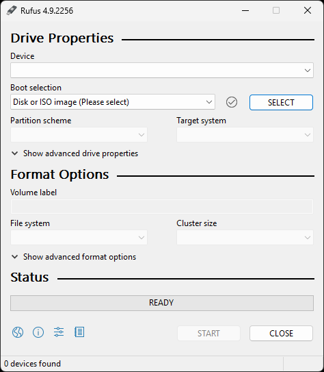

# Transferir o Windows

## Preparação

Antes de começar, verifica que tens o seguinte:

- Uma unidade USB com pelo menos 8GB de espaço

- Uma cópia de segurança dos teus ficheiros importantes

## Transferir um ISO

### Windows 10

- Vai à [página oficial de transferência](https://www.microsoft.com/en-us/software-download/windows10)
- Desce até `Create Windows 10 installation media` e carrega em `Download Now`
- Abre o programa transferido e segue as instruções para criar um ficheiro ISO

### Windows 11

- Vai à [página oficial de transferência](https://www.microsoft.com/en-us/software-download/windows11)
- Desce até `Create Windows 11 Installation Media` e carrega em `Download Now`
- Abre o programa transferido e segue as instruções para criar um ficheiro ISO

## Obter informação do sistema

Roda os seguintes comandos no PowerShell como administrador para obter informação do sistema.

Esta informação é importante para criar uma unidade USB inicializável.

### Esquema de partição

```
(Get-Disk -Number (Get-Partition -DriveLetter $env:SystemDrive.Substring(0, 1)).DiskNumber).PartitionStyle
```

### Estado do Secure Boot

```
Confirm-SecureBootUEFI
```

## Criar uma unidade USB inicializável

Rufus é uma ferramenta gratuita e de código aberto que permite criar uma unidade USB inicializável. Ao utilizar o Rufus, poderás **ignorar os requisitos de hardware do Windows 11** e **encurtar drasticamente o processo de configuração** sem ter de mexer no ISO ou em comandos de consola durante a instalação.

:::danger

Utilizar este processo vai apagar todos os ficheiros da unidade USB!

É recomendado fazer uma cópia de segurança dos teus ficheiros.

:::

### Transferir o Rufus

Para começar a criar uma unidade USB inicializável, teremos que transferir o Rufus.

- Vai à [página oficial de transferência](https://rufus.ie/en/)
- Desce até `Download` e transfere a versão mais recente do tipo `Standard`

### Configurar a unidade USB inicializável

- Inicia o Rufus que transferiste anteriormente
- Conecta a unidade USB ao sistema
- Na secção `Device`, seleciona a tua unidade USB
- Na secção `Boot selection`, carrega `SELECT` e seleciona o teu ISO
- Na secção `Partition scheme`, seleciona o esquema que obteste anteriormente
- Carrega em `START`
- Liga as seguintes opções:
    - `Remove requirement for 4GB+ RAM, Secure Boot and TPM 2.0`
    - `Remove requirement for an online Microsoft account`
    - `Disable data collection (Skip privacy questions)`
- Carrega em `OK` para começar a criação da unidade USB inicializável

